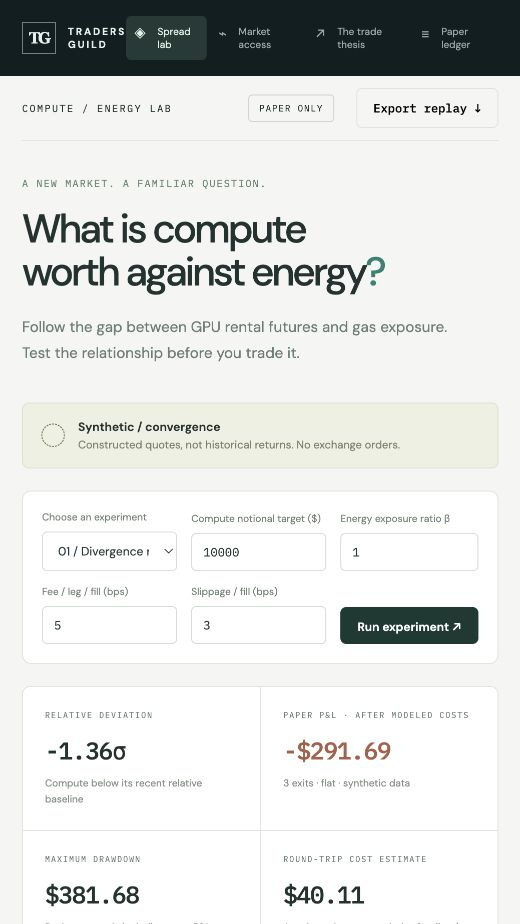
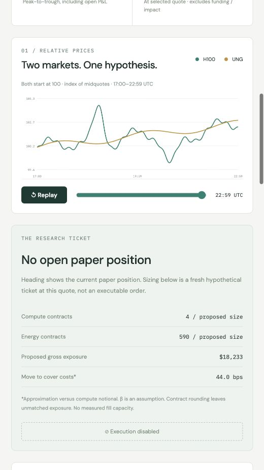
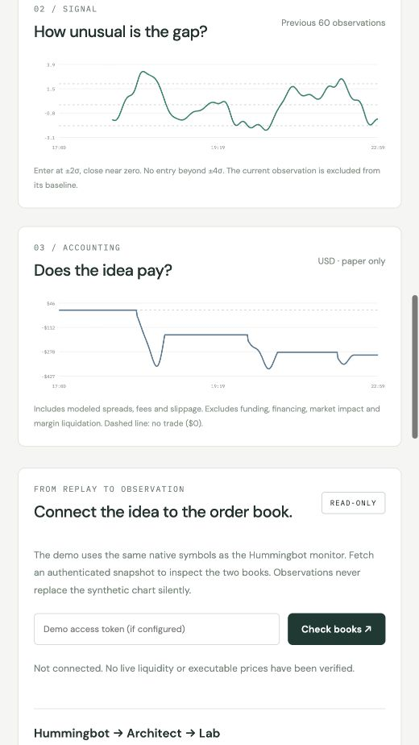

# Can energy traders find an edge in compute?

*We built a lab to explore GPU futures against energy exposure. The most useful lesson so far is where the trade can go wrong.*

A GPU can earn more per hour while the business operating it makes less money.

Higher rental prices tell you something about demand for compute. They do not tell you what is left after electricity, financing, hardware costs and idle capacity. For someone who trades energy, that distinction should feel familiar.

It also raises a question worth investigating: can knowledge of input costs help explain compute prices before the opportunity is obvious to everyone else?

That is the question behind the **Traders Guild Compute / Energy Lab**, a research dashboard we built around instruments listed in Architect’s catalogue.

*Screenshot 1. The lab opens with a clearly labeled synthetic experiment. The figures are simulated, not historical strategy returns.*

An energy trader already spends time thinking about what connects two markets, what can pull them apart, and whether the relationship survives the cost of trading it. Compute offers a new place to apply that discipline. Whether it offers an edge is still an open question.

Our initial experiment pairs H100 GPU futures with UNG perpetuals. Architect’s September 26 instrument snapshot lists a December 2026 H100 future representing **730 GPU-hours per contract**, alongside UNG exposure representing **one ETF share per contract**. The GPU contract references Compute Desk’s H100 index. Those details matter when sizing a position; buying one contract of each is not a balanced trade. [Instrument evidence](https://guild-compute-energy-lab.vercel.app/instruments.json).

The research idea is straightforward. If compute becomes unusually expensive relative to energy and the change appears temporary, investigate short compute against long energy. Investigate the reverse when compute becomes relatively cheap.

The difficult word in that sentence is “temporary.”

A shortage of suitable GPUs, stronger demand for a particular generation, or a change in available capacity could justify higher compute prices even if energy barely moves. Selling that divergence could mean betting against a real change in the market.

*Screenshot 2. Constructed midquotes, both indexed to 100. The ticket illustrates contract sizing and modeled costs. It does not establish that those quantities can be filled.*

There is another weakness to confront immediately: **UNG is not a datacenter’s electricity bill.**

It provides exposure through a natural-gas futures ETF. A datacenter faces a particular electricity market, power agreement and operating profile. That mismatch may be large enough to make the proposed pair unhelpful.

Architect has described a broader compute-spread framework connecting power inputs with GPU-hour output. Our gas-proxy experiment is one limited way to investigate relative prices; it does not yet reproduce those operating economics. [Architect’s framework](https://architect.co/insights/articles/intercommodity-spreads-crack-to-compute/).

This is why I wanted a working experiment that people could challenge.

The dashboard lets you change the exposure ratio, position size and trading costs, then replay the paper decisions. Three constructed scenarios show a gap that reverses, a relationship that breaks, and small price moves competing with execution costs.

In the default convergence scenario, the model finishes **$291.69 down**. That is a synthetic software experiment, not a result from trading Architect or a historical backtest.

The useful part is the explanation. The strategy compares prices with a moving historical baseline. A signal can move back toward that baseline without returning to a profitable exit price. Meanwhile, entering and exiting both legs costs money.

For scale, imagine a $10,000 position on each side. At assumed fees of 5 basis points and slippage of 3 basis points per leg per fill, the round trip costs approximately **$32 before quoted spreads**. A favourable 20-basis-point relative move on a $10,000 reference notional is only about $20. Being directionally right would not cover that assumed cost.

*Screenshot 3. A statistical signal returning toward normal does not guarantee a profitable exit. Paper P&L includes modeled spreads, fees and slippage, but excludes funding, financing, market impact and liquidation.*

The code is available in Python and Node.js. We have also added a read-only monitor using [Hummingbot’s Architect integration](https://hummingbot.org/exchanges/architect/) to collect paired book observations for research.

There is an important boundary: the official connector supports perpetuals, while the GPU contract is dated. Our monitor reads that contract’s market data by its native symbol. It does not add futures execution support, and we have not yet completed an authenticated Hummingbot runtime session. The public demo places no orders.

What would make the idea worth taking further?

Actual synchronized quotes. A relationship that survives a separate, unseen test period. Enough depth to enter and exit both legs. And a result that still holds after funding, spreads and the possibility that one order fills before the other.

I would also want to know whether energy explains anything beyond compute’s own price history. If it does not, adding an energy leg may simply add costs and another source of risk.

For energy traders, the invitation is to bring that skepticism into a new market. Which input would you use instead of UNG? Regional electricity? A different delivery period? Would you focus first on compute’s own forward curve?

That is the conversation this lab is meant to start.

**[Explore the lab](https://guild-compute-energy-lab.vercel.app/)** · **[Review the code contribution](https://github.com/uwecerron/architect-hummingbot/pull/1)**

*Disclosure: Architect is a Traders Guild client. For readers exploring the exchange, [this is my referral link](https://app.architect.exchange/signup?ref=UWE1). The lab is experimental research tooling, with no demonstrated trading edge.*
