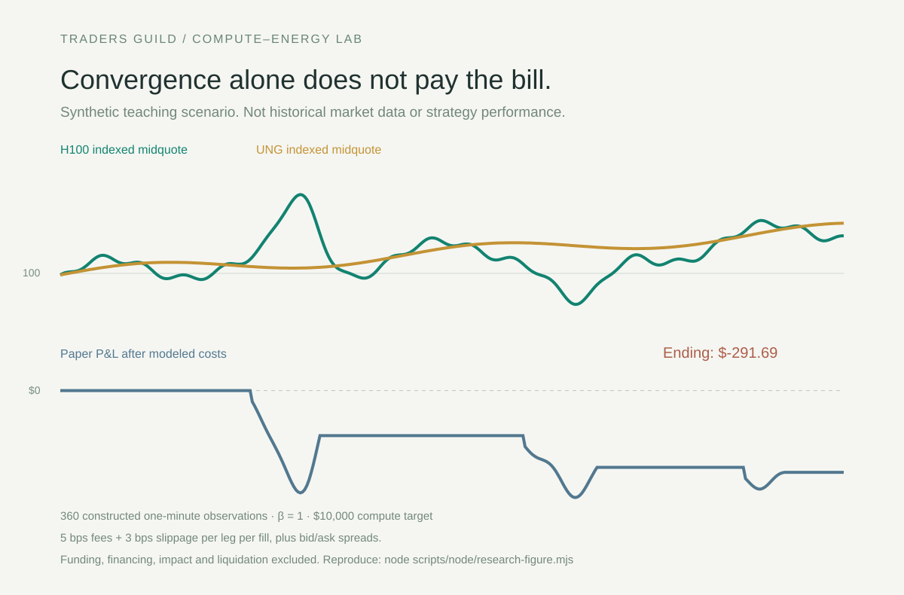

# The AI trade has an input cost. Can you trade the gap?

Traders Guild research draft · September 26, 2026

A GPU can earn more per hour while its owner's margins get worse. Electricity, financing and utilisation decide how much of that rental revenue survives. That makes the relationship between compute prices and energy costs worth watching, particularly for traders who already understand commodity spreads.

We built a small, open research lab to ask a narrow question: when GPU futures move unusually far relative to gas exposure, does the gap subsequently narrow enough to cover trading costs?

The first result is a reason to be careful. In our constructed convergence scenario, the default model loses money even though the price divergence eventually reverses. This is synthetic data designed to exercise the software, not market performance. But it exposes a real weakness in the rule: returning toward a moving statistical average does not mean returning to a profitable exit price.

## The instruments matter

Architect's instrument catalogue, retrieved September 26, lists an H100 December 2026 future and UNG perpetuals. The H100 contract represents 730 GPU-hours and references the Compute Desk NVIDIA H100 GPU Index. UNG exposure references an ETF, with its own natural-gas futures exposure and roll economics. A one-contract trade in one leg is not a hedge for one contract in the other.

This is a statistical pair hypothesis. It does not yet measure a datacenter's processing margin. An actual compute spark spread would need regional electricity prices, power usage and GPU utilisation. UNG is an imperfect energy proxy. A contract listing also does not establish that an account can trade it or that there is sufficient executable depth.

Architect's July article describes the broader compute-spread framework in the context of its planned AI Exchange. Our saved contract evidence comes separately from the AX gateway. Those are distinct sources and should not be presented as proof of identical venue access or product availability.

Sources: [Architect instruments](https://gateway.architect.exchange/api/instruments), [saved snapshot](./instruments.json), [Architect's spread framework](https://architect.co/insights/articles/intercommodity-spreads-crack-to-compute/).

## A trade idea with a reason to say no

The candidate trade is short compute and long energy when compute becomes unusually expensive relative to its recent energy relationship, provided the divergence appears temporary. Reverse the legs when compute becomes unusually cheap. In the prototype, a deviation of two standard deviations triggers a paper entry; the baseline uses the previous 60 observations and excludes the current quote.

That signal is a starting point. Before taking the other side of a compute rally, the trader needs to rule out a more durable explanation: GPU scarcity, a change in model demand, a different delivery region, hardware-generation substitution, or shifts in financing and power contracts. Any of those can justify a persistent repricing.

The default energy exposure ratio is one, a transparent assumption. It has not been estimated from historical observations. There is no demonstrated cointegration, no established optimal hedge and no evidence of out-of-sample profitability.

## The hurdle is higher than the chart suggests

Take an illustrative $10,000 compute leg matched by a $10,000 energy leg. At 5 basis points of fees and 3 basis points of slippage per leg per fill, entry and exit cost about $32 before quoted spreads. A 20-basis-point favourable relative move produces roughly $20 on a $10,000 reference notional. The signal can be directionally right and still lose money.

The dashboard sizes actual integer contracts using the 730-hour multiplier, displays the resulting exposure and estimates a round-trip cost hurdle. Its replay crosses the bid/ask and charges both legs at entry and exit. Funding, financing, market impact and liquidation remain outside the simulation. The cost hurdle is therefore incomplete, not an execution quote.

## What traders can investigate now

Three deterministic scenarios make the trade-off visible: a divergence that reverses, a relationship that breaks, and a small oscillation overwhelmed by costs. Change exposure, the assumed ratio and execution costs. Replay each decision or export the inputs and ledger to reproduce the result.

For actual observation, the Python monitor uses Hummingbot's official Architect connector for authenticated and throttled market-data requests. Its perpetual symbol mapper does not support the dated GPU future, so the read-only monitor requests that book by native symbol. It adds no dated-futures order handling. A separate Node collector reads the same native symbols and produces the same CSV schema. Both reject empty, stale, crossed or badly synchronized quotes.

The browser can import those observations. It never silently mixes them into a synthetic curve. Credentials remain on the server or in Hummingbot, and no route can place an order.

The local Python engine, Node port and mocked connector tests have passed. A full authenticated Hummingbot session has not been run in this environment. Live depth and the proposed relationship remain unverified.

## What would make this worth trading?

The next experiment is a synchronized quote-history study with a fixed training period and a separate holdout. Estimate a candidate exposure ratio only on training data, freeze it, and compare the pair against no-trade and single-leg baselines. Include actual funding, fee tiers, the dated contract's expiry and roll rules, market closures, and depth-limited fills. Do not optimize thresholds on the holdout or repeatedly select the most attractive sample.

Success would be repeatable net returns on fresh observations with tolerable drawdowns and enough executable size. Failure would be equally useful: a relationship that disappears after costs, works only in one short interval, or depends on an energy proxy that cannot explain compute prices.

For an energy trader, the opportunity is to test whether expertise in input costs helps explain a new market. The lab makes that question reproducible. It does not claim to have answered it.

Disclosure: Architect is a Traders Guild client. This is experimental research tooling, not a recommendation to enter a position. No referral links are included.
